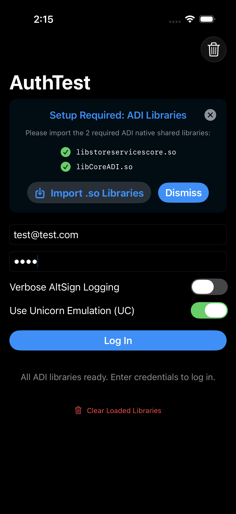
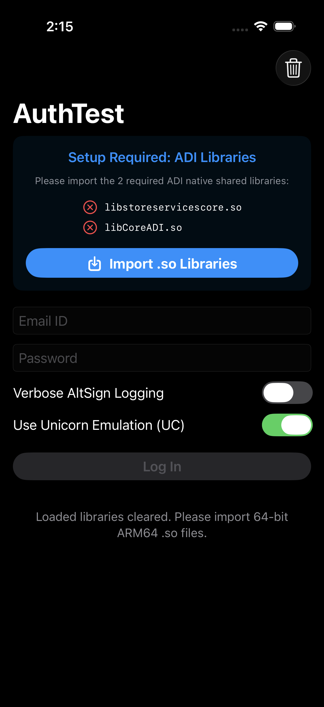
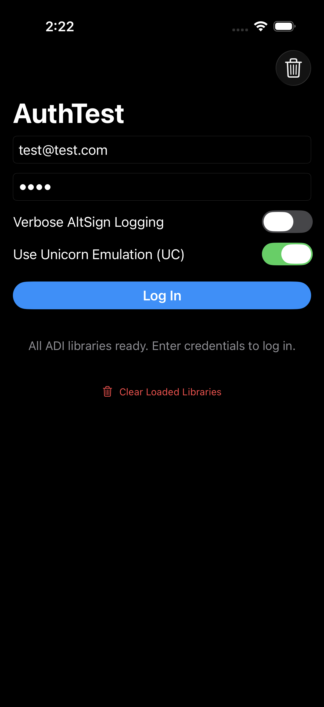

# AuthTest Platform Testing Compatibility Matrix

This document outlines the testing status, compatibility findings, and platform limitations for authentication using `AltSign` and `AnisetteKit`.

  
  
  
  

---

## Testing Compatibility Matrix

### Simulators

| Target Platform                            |  Status  | Notes                                                                                    |
| :----------------------------------------- | :------: | :--------------------------------------------------------------------------------------- |
| **iOS Simulator**                          | **Pass** | Full 2FA support and authentication successful.                                          |
| **iPadOS Simulator**                       | **Pass** | Fixed 2FA push dispatch issue by sanitizing ICU locale suffix (`@rg=inzzzz` -> `en_US`). |
| **visionOS Simulator**                     | **Pass** | Full authentication and 2FA support verified.                                            |
| **visionOS (Designed for iPad) Simulator** | **Pass** | Runs and authenticates smoothly.                                                         |
| **tvOS Simulator**                         | **Pass** | Fixed textFieldStyle tvOS availability; full authentication verified.                    |
| **watchOS Simulator**                      | **N/A**  | Target platform not available / unsupported.                                             |

---

### Physical Devices (Real Hardware)

| Target Platform               |  Status  | Notes                                                                                           |
| :---------------------------- | :------: | :---------------------------------------------------------------------------------------------- |
| **macOS**                     | **Pass** | Native host AArch64 execution and 2FA popup supported.                                          |
| **macOS (Designed for iPad)** | **Pass** | Native host AArch64 execution runs smoothly.                                                    |
| **macOS Catalyst**            | **Pass** | Native host AArch64 execution supported.                                                        |
| **iPhone**                    | **Pass** | Full on-device execution via Unicorn TCI bytecode interpreter (No JIT or remote server needed). |
| **iPad**                      | **Pass** | Full on-device execution via Unicorn TCI bytecode interpreter.                                  |
| **visionOS**                  | **Pass** | Full on-device execution via Unicorn TCI bytecode interpreter.                                  |
| **tvOS**                      | **Pass** | Full on-device execution via Unicorn TCI bytecode interpreter.                                  |
| **watchOS**                   | **N/A**  | Target platform not available / unsupported.                                                    |

---

## Disclaimer

This project is provided for **educational and research purposes only**.

- Use of this software is entirely at your own risk. The author and contributors assume no responsibility or liability for any damages, locked accounts, account penalties/bans, or legal repercussions arising from the use or distribution of this code.
- By using this software, you agree to comply with all applicable terms, laws, and regulations.

---

## License & Terms

`AuthTest` is licensed under the **GNU Affero General Public License v3.0 (AGPLv3)**.

### Key Terms:

- **Strong Copyleft**: Any application, framework, or tool that compiles against, links against (statically or dynamically), or includes `AuthTest` is considered a combined/derivative work and **must be fully open-sourced under the AGPLv3** upon distribution.
- **Network / Cloud Trigger (AGPL Section 13)**: If you run `AuthTest` as part of any network service, cloud API, or server backend, you **must make the complete, corresponding source code of the entire service and all linked software available** to all users interacting with it over the network.
- **Closed-Source / Proprietary Use Prohibited**: Closed-source, commercial, or proprietary distribution without full source disclosure is **strictly prohibited** under the AGPLv3.

Copyright © 2026 Magesh K. All rights reserved.

Full license information can be found at [LICENSE](./LICENSE)
